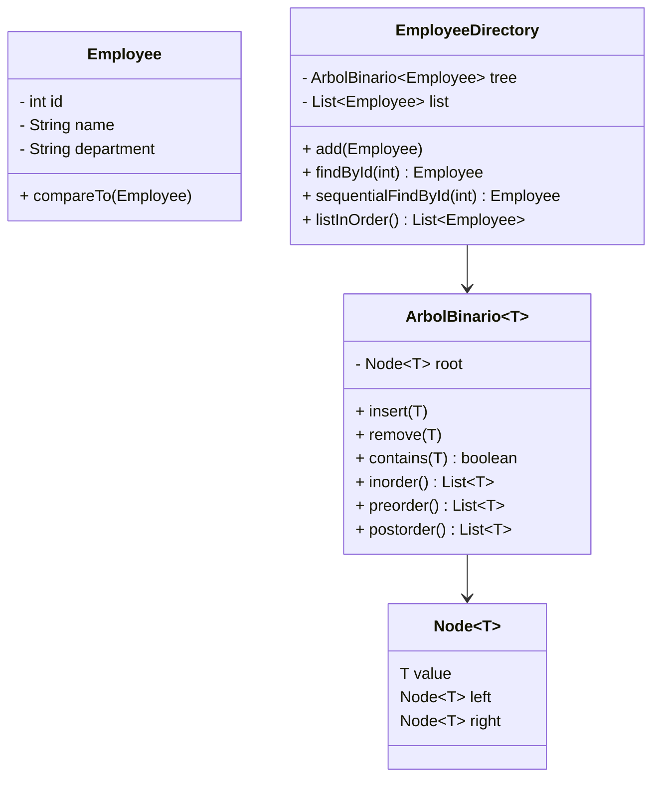
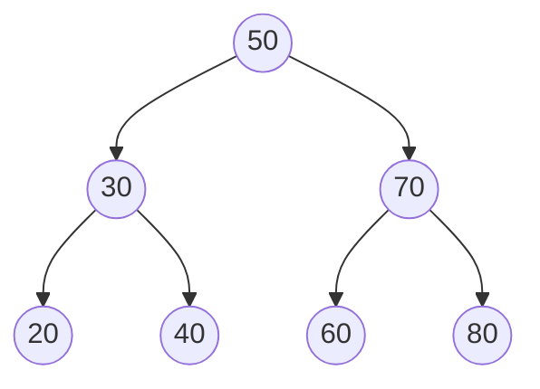
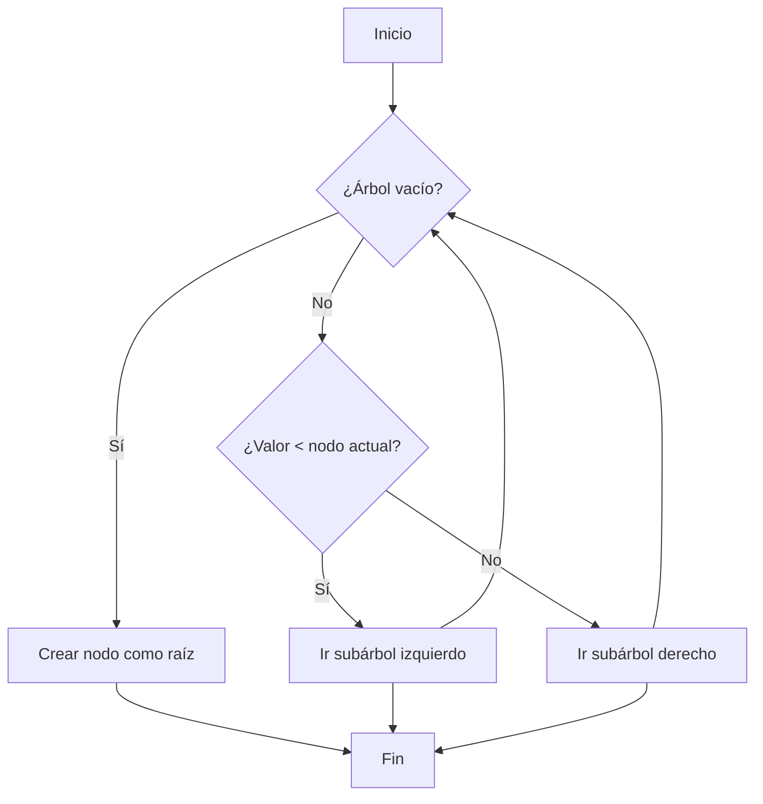

# Act 4 – Árboles Binarios (BST) y Gestión de Empleados

Este proyecto implementa un Árbol Binario de Búsqueda (BST) en Java con operaciones básicas (inserción, eliminación, búsqueda) y recorridos (preorden, inorden, postorden). Además, incluye un caso práctico de gestión de empleados utilizando el BST para optimizar búsquedas por ID.

---

## 🎯 Objetivo

- Comprender la estructura y funcionamiento de los árboles binarios.
- Implementar y manipular árboles binarios en Java.
- Aplicar los conceptos en un caso práctico: gestión de empleados.

---

## ✅ Requisitos

- Java JDK 17 o superior.  
- Entorno de desarrollo: Visual Studio Code / IntelliJ / Eclipse.  
- Sistema operativo: Windows, Linux o macOS.  
- Git y GitHub para control de versiones.  
- Consola o terminal para compilar y ejecutar.

---

## 🖥️ Tecnologías utilizadas

- **Java JDK 17+** → lógica y clases del BST.  
- **GitHub** → control de versiones y documentación.  
- **Markdown** → elaboración de README y reporte.  
- **Mermaid** → diagramas de clases y árboles.  
- (Opcional) **JUnit** → pruebas unitarias.  

---

## 📂 Estructura del Proyecto

```bash
Act_4_ED/
├── src/
│   └── act4ed/
│       ├── tree/
│       │   ├── Node.java
│       │   └── BinarySearchTree.java
│       │
│       ├── employee/
│       │   ├── Employee.java
│       │   └── EmployeeDirectory.java
│       │
│       └── Main.java
│
├── .gitignore
└── README.md
```
---

## 📌 API esencial

- **Nodo.java**: Representa cada nodo del árbol (ID del empleado, referencias izquierda/derecha).  
- **ArbolBinario.java**: Métodos principales:
  - `insertar(int id)`
  - `eliminar(int id)`
  - `buscar(int id)`
  - `recorridoInorden()`
  - `recorridoPreorden()`
  - `recorridoPostorden()`
- **Main.java**: Clase de prueba, crea el árbol y ejecuta operaciones de gestión de empleados.

---

## 📊 Diagramas

### Diagrama de clases


### Ejemplo de árbol tras inserciones



### Diagrama de flujo (inserción y eliminación)



---
## 🛠️ Cómo compilar y ejecutar

Requisitos: Java 17+ (cualquier JDK reciente funciona).

En Windows PowerShell:

```powershell
javac -d out src/act4ed/tree/*.java src/act4ed/employee/*.java src/act4ed/Main.java
java -cp out act4ed.Main
```

## 💻 Explicación del funcionamiento

 - El BST mantiene el orden por medio de Comparable<T>.
 - La búsqueda y eliminación siguen el algoritmo clásico (en eliminación, si el nodo tiene dos hijos se reemplaza con el sucesor inorden).
 - Los recorridos (inorden, preorden, postorden) se implementan recursivamente y se devuelven como listas.
 - Para empleados, el BST ordena por id. El directorio también guarda una lista lineal para comparar con búsqueda secuencial.

## 🧮 Complejidad

- Inserción: O(log n) en promedio, O(n) en el peor caso.
- Búsqueda: O(log n) en promedio, O(n) en el peor caso.
- Eliminación: O(log n) en promedio, O(n) en el peor caso.
- Recorridos: O(n).

## Evidencias de ejecución

Salida real al ejecutar el programa:

```text
DEMOSTRACIÓN: Árbol Binario (BST) numérico

Árbol después de inserciones:
                80
        70
                60
50
                40
        30
                20

Inorden:   [20, 30, 40, 50, 60, 70, 80]
Preorden:  [50, 30, 20, 40, 70, 60, 80]
Postorden: [20, 40, 30, 60, 80, 70, 50]
Buscar 60 -> true (pasos=3)

Eliminar 30 (nodo con dos hijos)

                80
        70
                60
50
        40
                20

Inorden tras eliminar: [20, 40, 50, 60, 70, 80]

============================================================

DEMOSTRACIÓN: Gestión de Empleados con BST

Empleados en orden por ID (inorden):
 - Employee{id=1001, name='Luis', dept='TI'}
 - Employee{id=1003, name='Diego', dept='TI'}
 - Employee{id=1005, name='Ana', dept='Ventas'}
 - Employee{id=1007, name='Sofía', dept='Finanzas'}
 - Employee{id=1009, name='Marta', dept='RH'}

Buscar ID 1007 -> BST: Employee{id=1007, name='Sofía', dept='Finanzas'} (pasos=3), Secuencial: Employee{id=1007, name='Sofía', dept='Finanzas'}
Buscar ID 1011 inexistente -> BST pasos=2, Secuencial: null

Conclusión: El BST reduce comparaciones respecto a una búsqueda secuencial, especialmente cuando crece el número de empleados.
```

---

## 🤔 Reflexión

Los árboles binarios de búsqueda permiten insertar, buscar y eliminar en tiempo promedio O(log n) manteniendo los datos ordenados. Son base de estructuras más avanzadas (AVL, Red-Black, B-Trees) usadas en bases de datos, compiladores y motores de búsqueda. En gestión de empleados, al crecer el número de registros, un BST reduce comparaciones frente a una búsqueda lineal, mejorando rendimiento sin requerir estructuras externas. 

---

## 👥 Autores

- Erick Mauricio Santiago Díaz (@Erick-MSD)
- Josué David Murillo Gómez (@Josuemgd15)
- Santiago Sebastian Rojo Márquez (@Sanlaan)
- Daniel Isai Sanchez Guadarrama (@DanielIsaiSG)

<!-- Fin del documento -->
